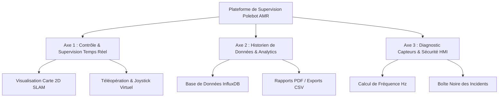
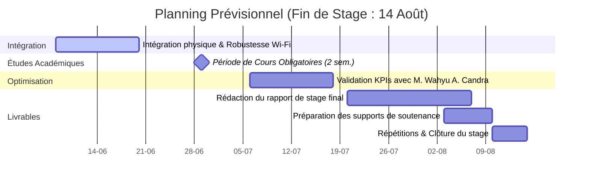

# 📝 Rapport de Mi-Parcours de Stage : Polebot AMR
**Sujet** : Développement d'une interface Web ROS, d'un historien de données et d'une plateforme analytique pour le robot mobile autonome Polebot AMR.  
**Sous la direction de** : M. Wahyu Adhie CANDRA  
**Période du rapport** : Mois 1 & Mois 2 (Avril - Juin 2026)  
**Date du document** : 8 juin 2026  

---

## 📑 Table des Matières
1. [Introduction](#1-introduction)
2. [Bilan du Mois 1 (Synthèse des Acquis)](#2-bilan-du-mois-1-synthèse-des-acquis)
3. [Avancées du Mois 2 (Analytical & Reporting Tools)](#3-avancées-du-mois-2-analytical--reporting-tools)
4. [État du Système Global (Architecture & Fonctionnalités en Production)](#4-état-du-système-global-architecture--fonctionnalités-en-production)
5. [Programme Prévisionnel jusqu'à la Soutenance](#5-programme-prévisionnel-jusquà-la-soutenance)
6. [Conclusion Provisoire & Bilan Personnel](#6-conclusion-provisoire--bilan-personnel)

---

## 1. Introduction

### Contexte du Projet
Dans le cadre de l'industrie 4.0, le déploiement de **Robots Mobiles Autonomes (AMR)** nécessite des outils de supervision robustes, ergonomiques et capables d'historiser la télémétrie pour optimiser les flux logistiques. Ce projet de stage porte sur le développement complet de l'écosystème de supervision du robot **Polebot AMR**.

L'interface développée est structurée autour de **trois axes majeurs** :



1. **Axe 1 : Contrôle et Télémétrie Temps Réel** : Visualisation de la carte 2D générée par SLAM, affichage des flux caméra et Lidar, et pilotage à distance (téléopération sécurisée).
2. **Axe 2 : Historien de Données (Data Historian) et Analytics** : Stockage temporel continu des données capteurs et génération de KPIs clés de performance pour optimiser le comportement du robot.
3. **Axe 3 : Diagnostic Capteurs et Fiabilité Industrielle** : Surveillance active de l'état de santé des capteurs, gestion des incidents critiques et outils réseau de résilience (gestion de la bande passante).

---

## 2. Bilan du Mois 1 (Synthèse des Acquis)

Le premier mois a été consacré à la mise en place des briques fondamentales de l'application et à la connectivité avec le robot.

### Fondations Techniques Établies
*   **Connexion ROS 2 (Websockets)** : Intégration de la bibliothèque `roslibjs` pour communiquer de manière bidirectionnelle avec le pont `rosbridge_suite` installé sur le système d'exploitation du robot.
*   **IHM Moderne (Vue 3 & CSS Variables)** : Création d'une interface web monopage interactive et fluide basée sur l'API de composition de Vue 3, avec un design industriel sombre "Deep Space".
*   **Visualisation Cartographique 2D** : Développement d'un moteur de rendu sur élément `<canvas>` HTML5 pour afficher dynamiquement la grille d'occupation `/map` (SLAM) et les points d'impact du Lidar `/scan` en temps réel.
*   **Téléopération de Base** : Implémentation du joystick virtuel tactile et des boutons de contrôle publiant sur `/cmd_vel`.

> [!NOTE]
> À l'issue du Mois 1, le canal de communication temps réel était opérationnel, permettant de visualiser la position $(X, Y, \theta)$ du robot et de le piloter dans son environnement de simulation.

---

## 3. Avancées du Mois 2 (Analytical & Reporting Tools)

Le Mois 2 a constitué le cœur analytique et de fiabilisation du projet. L'objectif était de valoriser la télémétrie brute en y associant une base de données temporelle, des algorithmes d'analyse comportementale et des outils réseau résilients.

### A. Télémétrie Temporelle & InfluxDB
Pour stocker la télémétrie haute fréquence sans surcharger le microcontrôleur embarqué du robot, nous avons connecté le tableau de bord à une base de données temporelle **InfluxDB 2.x** via son API HTTP.
*   **Pipeline 1 Hz** : Un intervalle asynchrone capture l'odométrie, le niveau de batterie et la télémétrie Lidar pour les insérer dans le bucket `polebot_telemetry` sous forme de points temporels structurés :
    $$\text{Point} = \{ \text{Measurement: } \text{"telemetry"}, \text{ Tags: } \{ \text{robot\_id: } \text{"polebot\_01"} \}, \text{ Fields: } \{ \text{linear\_speed}, \text{ angular\_speed}, \text{ battery}, \text{ obstacle\_dist} \} \}$$
*   **Suivi de Sessions** : Chaque démarrage et fin de mission est journalisé dans le bucket `robot_sessions` avec le temps d'utilisation réel pour estimer le MTBF (*Mean Time Between Failures*).

### B. Algorithme du Stability Index (Calcul du Jerk)
L'indice de stabilité est un indicateur de la fluidité de conduite, calculé à partir de la vitesse linéaire brute stockée dans InfluxDB :
1.  **Filtrage** : Exclusion des valeurs nulles résultant de pertes de paquets transitoires.
2.  **Calcul de l'accélération (Jerk à $\Delta t = 1\text{ s}$)** :
    $$a_i = \frac{v_i - v_{i-1}}{\Delta t} = v_i - v_{i-1}\text{ (en m/s}^2)$$
3.  **Détection des à-coups** : Si $|a_i| > 0.15\text{ m/s}^2$ (seuil limite de confort et de sécurité mécanique pour les charges utiles du Polebot), le compteur d'à-coups (`jerkCount`) est incrémenté.
4.  **Formule du score** :
    $$\text{StabilityIndex} = \max(0, 100 - (2 \times \text{jerkCount}))\%$$
Un score inférieur à 80% signale au superviseur une conduite heurtée ou des manœuvres répétées d'évitement d'obstacles.

### C. Le Mode Démo (Simulation Autonome)
Afin de pouvoir présenter et tester l'HMI sans connexion physique au robot, un simulateur a été directement intégré dans le composable `useRos.js`.
*   **Principe de Fonctionnement** : L'activation de `isDemoMode` court-circuicte la WebSocket et lance une boucle `setInterval` cadencée à 10 Hz ($\Delta t = 100\text{ ms}$).
*   **Génération Algorithmique des Variables** :
    *   **Position circulaire** : $X(t) = R \cos(t)$ et $Y(t) = R \sin(t)$ avec $R = 2.5\text{ m}$ et une vitesse angulaire fictive de $0.15\text{ rad/s}$.
    *   **Orientation (Yaw)** : $\theta(t) = (t \bmod 2\pi) - \pi$.
    *   **Fréquences Capteurs (Diagnostics)** : Odometrie simulée à 50 Hz, scan Lidar à 10 Hz et Grid Map à 1 Hz pour peupler le moniteur de fréquence en temps réel.
    *   **Qualité Réseau** : Simulation d'une latence oscillant aléatoirement entre 12 ms et 17 ms.

### D. Moniteur de Ping & Mode Basse Bande Passante (Resilience Réseau)
En environnement industriel, le Wi-Fi subit d'importantes atténuations. Un moniteur de ping passif estime en continu le *Round-Trip Time* (RTT) sur la WebSocket de contrôle.
*   **Déclenchement du Mode Dégradé** : Dès que $\text{RTT} > 150\text{ ms}$ sur 3 mesures consécutives, l'indicateur `isLowBandwidthMode` passe à `true`.
*   **Actions Côté Code** :
    1.  **Throttling du Rendu de Carte** : L'ingestion et le décodage de la grille d'occupation `/map` (le topic le plus lourd, transmettant des matrices de $1000 \times 1000$ pixels) sont bridés. Au lieu de redessiner le Canvas à chaque message (1 Hz), l'affichage saute 4 trames sur 5 (fréquence de rendu abaissée à 0.2 Hz).
    2.  **Optimisation CPU** : Suspension du traçage des points Lidar secondaires hors du cône avant de détection pour décharger le thread principal du navigateur.
    3.  **Alerte Visuelle** : Affichage d'un badge jaune clignotant "⚠️ Low Bandwidth" sur l'en-tête de l'HMI.

### E. Structure des Exports PDF & CSV
*   **Export CSV** : Extraction directe des données InfluxDB sous format tabulaire structuré : `Timestamp, Battery %, Linear Speed, Angular Speed, X, Y, Yaw, Obstacle Distance`.
*   **Rapport PDF (jsPDF & html2canvas)** : Génère un rapport de fin de session structuré en 3 sections :
    1.  **Fiche Synthèse KPI** : Durée de fonctionnement, distance totale parcourue, efficacité globale (%) et indice de stabilité finale.
    2.  **Rendu Graphique** : Capture d'écran haute définition du graphique de session. Le plugin personnalisé `whiteBackgroundPlugin` intercepte l'export Chart.js pour forcer un arrière-plan blanc uni, changeant les axes en gris foncé afin de garantir une lisibilité optimale à l'impression.
    3.  **Journal de Sécurité** : Historique abrégé des incidents extraits de la Boîte Noire (arrêts d'urgence, sous-tensions de batterie).

### F. Gestion des Rôles (RBAC) & Sécurisation de l'Interface
Pour répondre aux exigences industrielles de sécurité, un système d'authentification et d'autorisations (Role-Based Access Control) a été implémenté directement dans l'interface front-end :
*   **Overlay de Connexion** : Au démarrage, l'application bloque l'accès et demande un identifiant/mot de passe.
*   **Rôles Dynamiques** : 
    *   **Administrateur (`polebot01`)** : Accès total à tous les onglets (Live Control, Operator Panel, Analytics, KPI, Diagnostics, Architecture, Maintenance).
    *   **Opérateur (`polebot02`)** : Interface restreinte masquant les données sensibles et limitant l'accès uniquement au Live Control et à l'Operator Panel.
*   **Stockage de Session** : Le token de session est stocké temporairement dans le `sessionStorage` du navigateur, garantissant que l'utilisateur est déconnecté à la fermeture de l'onglet.

### G. Panneau de Maintenance Prédictive & Architecture Système
Une évolution majeure de la fin du Mois 2 a été la transformation du tableau de bord en un outil de diagnostic préventif complet :
*   **Maintenance Prédictive** : Création d'un module estimant en temps réel l'usure des composants mécaniques (Moteurs Gauche/Droit, Roues) et électroniques (Lidar RPLidar A1) à partir des données d'usage odométriques.
*   **Graphe Interactif ROS2** : Développement d'un diagramme nodal dynamique (généré dynamiquement en SVG) visualisant les flux de données entre les `nodes` (ex: `/nav2_stack`, `/slam_toolbox`) et les `topics` (`/cmd_vel`, `/odom`). Ce graphe interactif permet de déboguer rapidement l'architecture logicielle du robot.
*   **Notifications Globales (Toasts)** : Implémentation d'un système de notifications flottantes pour informer l'opérateur de tout événement critique (Arrêt d'Urgence engagé, batterie faible) peu importe l'onglet actif.
*   **Internationalisation & Thèmes** : Standardisation de l'ensemble du code source, des logs et de l'interface graphique en anglais pour un usage universel. Finalisation d'un système de thèmes CSS permettant de basculer du "Deep Space" (Sombre) au mode Clair.

### H. Outil de Téléopération de Test (Hors-Consigne)
Bien que non demandé dans le cahier des charges initial, un module de téléopération complet (D-Pad interactif, contrôles clavier Z/Q/S/D, et réglage fin des vitesses maximum) a été développé. Son but n'est pas d'être l'interface de pilotage finale pour l'utilisateur (le pilotage se faisant via la carte SLAM), mais de servir d'**outil de test interne et de débogage**. 
Afin de ne pas polluer l'interface utilisateur web globale, ce panneau de test est délibérément isolé : il s'ouvre dans un nouvel onglet, accessible uniquement via un lien de vérification de mouvement situé dans la section *Operator Panel*.

### I. Tableau des Difficultés Techniques Rencontrées & Solutions

| Difficulté Rencontrée | Cause Technique | Solution Apportée |
| :--- | :--- | :--- |
| **Effet d'échelle des graphiques** | La batterie (0-100) et la vitesse (0-0.5) écrasaient l'affichage sur un seul axe Y. | Implémentation d'axes Y doubles indépendants avec visibilité dynamique en fonction des filtres actifs. |
| **Surcharge réseau en Wi-Fi instable** | Les messages `/map` très lourds saturaient le réseau local lors des pings élevés. | Création du moniteur de ping (RTT) dynamique et du mode basse bande passante automatique. |
| **Indisponibilité matérielle** | Accès limité au robot physique lors des phases de développement de l'IHM. | Développement du Mode Démo autonome simulant la télémétrie complète à 10 Hz directement dans les composables. |
| **Gel de l'UI sous flux ROS2** | La réactivité de Vue 3 peinait à digérer les paquets odométriques reçus à 50 Hz. | Découplage de la réactivité Vue : les données de scan Lidar et de carte sont stockées dans des variables JS classiques et dessinées sur le Canvas via un thread graphique `requestAnimationFrame`. |
| **Erreurs CORS InfluxDB** | Connexion directe bloquée par le navigateur entre l'origine `http://localhost:5173` et le port InfluxDB `8086`. | Configuration de la politique CORS du serveur InfluxDB (`cors-allowed-origins`) et sécurisation des tokens de lecture/écriture. |
| **Perte de connexion WebSocket silencieuse** | Le navigateur gardait la socket ouverte même en cas de coupure brutale du Wi-Fi du robot. | Implémentation d'un heartbeat régulier (ping-pong applicatif à 2 Hz) avec reconnexion automatique après 3 échecs. |

---

## 4. État du Système Global & Choix d'Architecture

L'application est aujourd'hui dans un état très mature, compilée sans erreur sous Vite et prête pour le déploiement sur la tablette de contrôle des opérateurs.

```
polebot_analytics/dashboard/
├── dist/                  # Bundle de production optimisé et minifié par Vite
└── src/
    ├── components/
    │   ├── LiveControl.vue        # Pilotage, HUD sécurité, SLAM et carte 2D
    │   ├── AnalyticsHistory.vue   # Graphiques historiques et outil d'export PDF/CSV
    │   ├── KpiDashboard.vue       # Statistiques d'efficacité opérationnelle
    │   └── SensorDiagnostics.vue  # Moniteur de fréquence des capteurs et Black Box
    └── composables/
        ├── useRos.js              # Singleton de connexion ROS 2 & simulateur
        ├── useBlackBox.js         # Journal persistant localStorage des incidents
        └── useAudio.js            # Synthétiseur de sons d'alarmes (Web Audio API)
```

### A. Détail de la Boîte Noire (`useBlackBox.js`)
La boîte noire a été conçue pour capturer les événements critiques qui surviennent en cours de fonctionnement. Elle stocke localement (via le `localStorage` du navigateur pour persister aux recharges accidentelles de la page) les 100 derniers incidents majeurs.
Chaque log comporte un identifiant unique aléatoire, une date (`timestamp`), un niveau de sévérité (`Critical`, `Warning`, `Info`), un type et une description textuelle détaillée.
Les déclencheurs automatiques câblés dans les watchers de Vue sont :
1.  **Connection Drop** (`Critical`) : Déclenché instantanément lorsque la WebSocket ROS2 bridge perd le signal.
2.  **Connection Established** (`Info`) : Enregistre le succès de la poignée de main WebSocket.
3.  **E-STOP Active** (`Critical`) : Loggé dès que l'arrêt d'urgence logiciel ou matériel est engagé par l'opérateur.
4.  **E-STOP Released** (`Info`) : Trace le déverrouillage sécurisé du robot.
5.  **Collision Risk** (`Warning`) : Déclenché lorsque le Lidar détecte un obstacle à moins de 0.5 mètre.
6.  **Low Battery** (`Warning`) : Déclenché si la batterie descend sous la barre critique des 20% (avec un mécanisme de verrou pour éviter de logger en boucle le message).
7.  **Log Cleared** (`Info`) : Enregistre l'action manuelle de l'opérateur vidant le journal.

### B. Synthétiseur Audio Embarqué (`useAudio.js`)
Pour éviter le chargement de fichiers audio lourds et lents à charger sur le réseau (ex. `.wav` ou `.mp3`), les alarmes de l'IHM sont générées en temps réel à l'aide de l'**API Web Audio** du navigateur.
*   **Alarme Arrêt d'Urgence (E-STOP Horn)** :
    *   **Architecture** : Combinaison de deux oscillateurs analogiques virtuels en parallèle pour créer un signal dissonant et percutant.
    *   **Fréquences** : L'oscillateur 1 génère une onde en dent de scie (*sawtooth*) à $440\text{ Hz}$ (A4). L'oscillateur 2 génère une onde en dent de scie à $380\text{ Hz}$ pour introduire un battement acoustique anxiogène.
    *   **Enveloppe de Gain** : Le volume initial est réglé à $0.08$ et décroît de manière exponentielle jusqu'à $0.01$ sur une durée de $0.25\text{ seconde}$.
*   **Alerte Collision Proximité (Radar Sweep)** :
    *   **Architecture** : Un oscillateur unique effectuant un balayage de fréquence rapide.
    *   **Signal** : Forme d'onde triangulaire (*triangle*) pour un timbre plus doux mais audible. La fréquence démarre à $600\text{ Hz}$ et subit une rampe exponentielle jusqu'à $1200\text{ Hz}$ en $0.15\text{ seconde}$.
    *   **Volume** : Atténuation exponentielle rapide du gain de $0.07$ à $0.005$ en $0.15\text{ seconde}$ pour simuler un "bip" de radar.

---

## 5. Programme Prévisionnel jusqu'à la Soutenance

Le planning des prochaines semaines prend en compte une période d'indisponibilité de **2 semaines de cours obligatoires** et s'étend jusqu'à la fin officielle du stage fixée au **14 août 2026**.



### Jalons Clés & Répartition des Tâches :
*   **Du 8 au 19 juin (Intégration Physique & Robustesse)** : Campagne de tests sur le robot physique dans l'atelier pour valider le comportement en conditions réelles de perturbation réseau (Wi-Fi industriel) et affiner la réactivité du Mode Basse Bande Passante.
*   **Du 22 juin au 3 juillet (Période de Cours)** : Pause dans les développements physiques sur site en raison du suivi des cours obligatoires. Quelques travaux théoriques et de rédaction préliminaire du rapport seront menés à distance durant cette quinzaine.
*   **Du 6 au 17 juillet (Optimisation analytique & Validation)** : Reprise de l'accès au robot physique. Confrontation des KPIs d'efficacité et de stabilité avec des profils de conduite réels et ajustements des seuils d'alerte avec M. Wahyu Adhie CANDRA.
*   **Du 20 juillet au 6 août (Rédaction du Rapport de Stage)** : Phase principale d'écriture du mémoire de stage, de consolidation de la documentation technique de l'API HMI, et de mise au propre du guide de maintenance.
*   **Du 7 au 14 août (Préparation de la Soutenance & Livraison)** : Création des slides de présentation, répétitions orales blanches, archivage du code sur le dépôt central et clôture officielle du stage le 14 août.

---

## 6. Conclusion Provisoire & Bilan Personnel

### Retours du Tuteur Industriel & Démo Académique
*   **Retour de M. Wahyu Adhie CANDRA (Tuteur)** : Le tuteur s'est montré extrêmement satisfait de la réactivité temps réel du tableau de bord ainsi que du choix graphique "Deep Space" qui améliore le contraste en atelier sombre. À sa demande, deux fonctionnalités ont été ajoutées : le **Mode Démo** (pour pouvoir présenter l'IHM aux clients internes sans allumer le robot physique) et le **mode basse bande passante** automatique (suite à des saccades constatées lors des tests de navigation longue distance).
*   **Démonstrations Académiques** : Une démonstration sur simulateur et en Mode Démo a été réalisée auprès de mes pairs étudiants et de mon responsable de suivi d'école. Les retours ont salué la clarté de la carte SLAM interactive en Canvas et l'originalité du système d'alarmes synthétisées localement.

### Bilan Technique
Ces deux premiers mois ont permis de transformer un besoin de supervision classique en une solution industrielle complète et robuste. Le couplage de Vue 3, ROS 2 et InfluxDB démontre qu'il est possible de créer des interfaces de contrôle légères, réactives et hautement analytiques sans recourir à des logiciels propriétaires lourds.

### Compétences Acquises
Ce projet m'a permis d'approfondir mes compétences dans des domaines de pointe :
*   **Ingénierie Système & Robotique** : Modélisation des messages ROS 2, gestion de la bande passante réseau et synchronisation de données asynchrones.
*   **Développement Web Avancé** : Optimisation du rendu graphique 2D (`Canvas`) et manipulation de flux de données temporels (InfluxDB).
*   **Conception HMI Centrée Sécurité** : Prise en compte de l'opérateur humain via des alertes sonores et un journal de boîte noire.

Les retours positifs du superviseur de stage constituent une motivation supplémentaire pour finaliser l'intégration physique et livrer un produit totalement fonctionnel au département de recherche.
